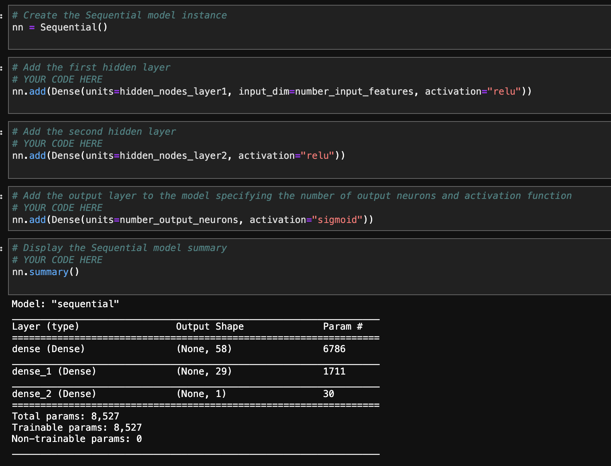
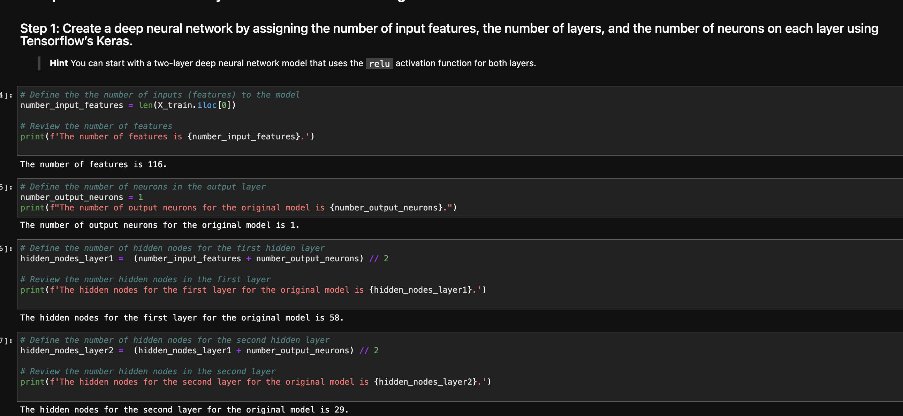
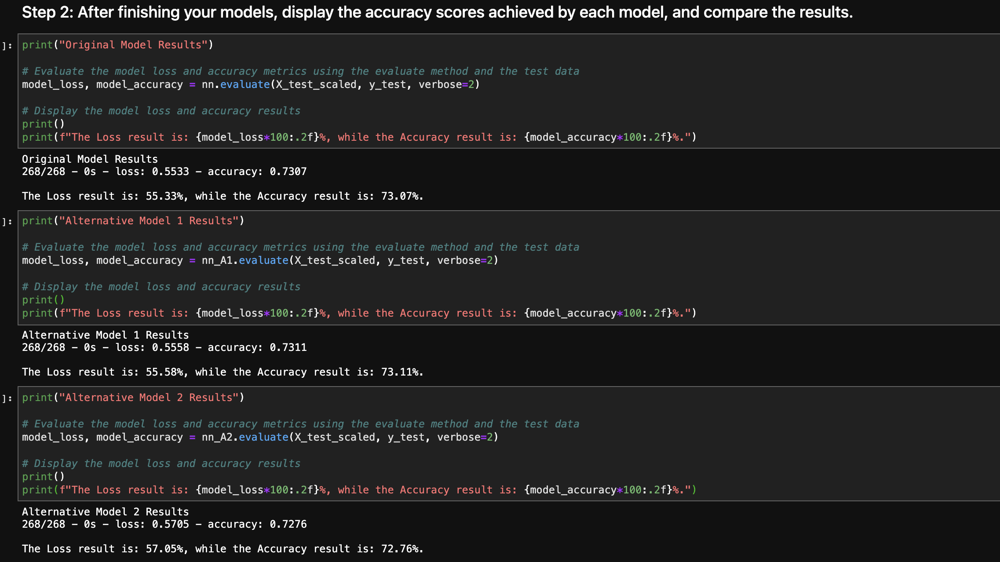
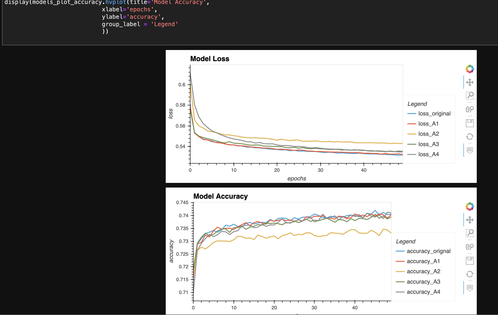

# **Venture Funding with Deep Learning**

## Overview

This neural network model is used to create a prediction application to learn the applicants' successful rate if funded by Alphabet Soup. The preiction application takes into account four different alternative models as a way to learn different techniques on the neural network model that could potentially increase the model accuracy and decrease the model loss.

---

## Technologies

This project leverages **[python version 3.8.5](https://www.python.org/downloads/)** with the following packages and modules:

* [pandas](https://pandas.pydata.org/docs/) - This was used to be able to easily manipulate dataframes.

* [Jupyter Lab](https://jupyterlab.readthedocs.io/en/stable/) - This was used to be able to create and share documents that contain live code, equations, visualizations and narrative text.

* [Scikit Learn](https://scikit-learn.org/stable/) - *version 0.24.2* - This package has a lot of different tools and model that could be use to create a machine learning model.

    * [train test split](https://scikit-learn.org/stable/modules/generated/sklearn.model_selection.train_test_split.html) 

    *  [Standard Scaler](https://scikit-learn.org/stable/modules/generated/sklearn.preprocessing.StandardScaler.html) - Standardize features by removing the mean and scaling to unit variance.

    * [OneHotEncoder](https://scikit-learn.org/stable/modules/generated/sklearn.preprocessing.OneHotEncoder.html) - Encode categorical features as a one-hot numeric array.

* [TensorFlow](https://www.tensorflow.org/) - *version 2.6.0* - This is an end-to-end open source platform for machine learning. It has a comprehensive, flexible ecosystem of tools, libraries, and community resources that lets researchers push the state-of-the-art in ML and developers easily build and deploy ML-powered applications.

* [Keras](https://keras.io/) - *version 2.6.0* - This is an API designed for human beings, not machines. Keras follows best practices for reducing cognitive load: it offers consistent & simple APIs, it minimizes the number of user actions required for common use cases, and it provides clear & actionable error messages. It also has a free open source Python library for developing and evaluating deep learning models.

     *  [layers Dense](https://www.tensorflow.org/api_docs/python/tf/keras/layers/Dense) - This implements the operation: output = activation(dot(input, kernel) + bias) where activation is the element-wise activation function passed as the activation argument, kernel is a weights matrix created by the layer, and bias is a bias vector created by the layer (only applicable if use_bias is True).

     * [models Sequential](https://keras.io/guides/sequential_model/) - This is used appropriately for a plain stack of layers where each layer has exactly one input tensor and one output tensor.

     * [layers LeakyReLU](https://www.tensorflow.org/api_docs/python/tf/keras/layers/LeakyReLU) - This is a “leaky” alternative to the ReLU function. This means that instead of transforming negative input values to 0, it transforms negative input values into much smaller negative values.

     * [ReLU](https://keras.io/api/layers/activations/) - The rectified linear unit (ReLU) function returns a value from 0 to infinity. This activation function transforms any negative input to 0. It is the most commonly used activation function in neural networks due to its faster learning and simplified output. However, it is not always appropriate for simpler models.

* [PyVizlot](https://pyviz.org/) -  Python visualization package that provides a single platform for accessing multiple visualization libraries. Two of the libraries are:

  * [hvplot.pandas](https://hvplot.holoviz.org/user_guide/Introduction.html) - *version 0.7.2* - For the interactive visualization of the crowdfunding data.

 
---
## Installation Guide

### 1. Installing and Running Jupyter notebook

On the terminal, under the conda dev environment, type the code below:

`pip install jupyterlab`

#### * Opening Jupyter notebook

If you have Jupyter Lab already installed, to open your Notebook and be able to view your hidden files, please type this while on your conda dev environment:

`jupyter lab --ContentsManager.allow_hidden=True` 

Once you click ENTER, this will open on your default browser.

---

### 2. Installing Scikit-learn
- To install the Scikit-learn, check that your development environment is active, and then run the following command:

    `pip install -U scikit-learn`

- To check if scikit-learn is already installed, you can run the following code on your dev environment:

    `conda list scikit-learn`

   

---

### 3. Installing TensorFlow (TF) 
- To install the TensorFlow, check that your development environment is active, and then run the following command:

    `pip install --upgrade tensorflow`

- To verify if TensorFlow is already installed, you can run the following code on your dev environment:

    `python -c "import tensorflow as tf;print(tf.__version__)"`

---

### 4. Keras

- To verify if Keras is already installed, you can run the following code on your dev environment:

    `python -c "import tensorflow as tf;print(tf.keras.__version__)"`

---
## Examples

Here are some of the data we did for this model.

   

   

---

## Usage

To be able to get a good analysis on the prediction analysis, we need to be able to model, fit and predict using activation model ReLU, LeakyReLu and Sigmoid. 

---

## Contributors

Contributed by: Justine Cho

Email: juz317_cho@yahoo.com

[ LinkedIn](https://www.linkedin.com/in/justinecho)

---

## License

### **MIT License**

Copyright (c) [2021] [Justine Cho]

Permission is hereby granted, free of charge, to any person obtaining a copy
of this software and associated documentation files (the "Software"), to deal
in the Software without restriction, including without limitation the rights
to use, copy, modify, merge, publish, distribute, sublicense, and/or sell
copies of the Software, and to permit persons to whom the Software is
furnished to do so, subject to the following conditions:

The above copyright notice and this permission notice shall be included in all
copies or substantial portions of the Software.

THE SOFTWARE IS PROVIDED "AS IS", WITHOUT WARRANTY OF ANY KIND, EXPRESS OR
IMPLIED, INCLUDING BUT NOT LIMITED TO THE WARRANTIES OF MERCHANTABILITY,
FITNESS FOR A PARTICULAR PURPOSE AND NONINFRINGEMENT. IN NO EVENT SHALL THE
AUTHORS OR COPYRIGHT HOLDERS BE LIABLE FOR ANY CLAIM, DAMAGES OR OTHER
LIABILITY, WHETHER IN AN ACTION OF CONTRACT, TORT OR OTHERWISE, ARISING FROM,
OUT OF OR IN CONNECTION WITH THE SOFTWARE OR THE USE OR OTHER DEALINGS IN THE
SOFTWARE.
